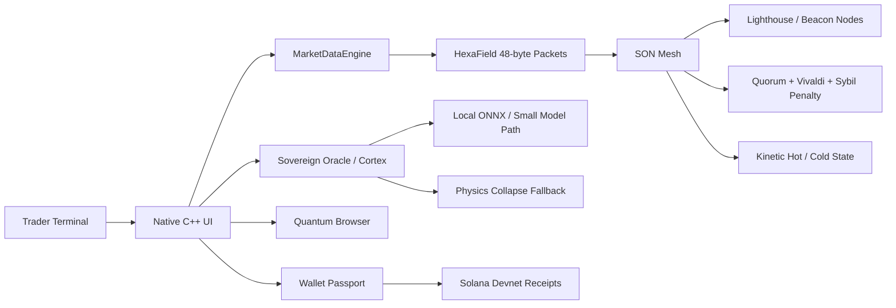

# AnonLabs Sovereign Whitepaper

## The Retail Trading Terminal Where Every User Becomes a Node

**Product:** AnonLabs Sovereign  
**Network:** Sovereign Octahedral Network (SON)  
**Protocol:** HexaField  
**Market Intelligence:** Sovereign Oracle / Cortex  
**Browser Layer:** Quantum  
**Ledger State:** Kinetic Hot/Cold State  

## Abstract

AnonLabs Sovereign is a native C++ trading terminal, agentic browser, wallet passport, local intelligence engine, and node-powered market data network.

The core idea is not only "a better UI." Sovereign turns the trader's own machine into part of the execution stack. The terminal renders locally, reasons locally, stores hot/cold state locally, and can share real observed market state with other active nodes. More users should make the network stronger instead of making a central backend weaker.

Sovereign combines five technical layers:

1. A native OpenGL3/ImGui trading terminal built outside the browser DOM.
2. HexaField, a fixed 48-byte binary packet protocol for low-overhead decisions.
3. SON, a peer-assisted network with lighthouses, Vivaldi latency coordinates, Sybil penalties, quorum, and hot/cold state.
4. Sovereign Oracle / Cortex, a forensic market intelligence engine for derivatives, liquidity, whale wallets, and on-chain activity.
5. Sovereign Alpha, an in-training local model path for Oracle/Cortex reasoning, agentic behavior, and low-cost local inference.
6. Quantum, an embedded agentic browser with local memory, image/snapshot context, API settings, and custom security.

The project is designed around one thesis:

**The terminal is the node.**

## Problem

Retail trading infrastructure is mostly web dashboards sitting on top of centralized APIs, rate-limited RPC, and server-heavy chart hydration. That creates predictable weaknesses:

- Every new client asks the same servers for the same data.
- Browser UI stacks burn memory before doing useful trading work.
- Strategy and execution state often live outside the terminal.
- Wallets are separated from identity, layout, browser memory, receipts, and compute policy.
- AI features become expensive and slow when every action routes to a heavy cloud model.

Sovereign solves this by moving the important work closer to the user: native rendering, local inference, deterministic physics fallback, node-shared real candles, and a wallet identity that binds the whole terminal.

## System Overview

Sovereign is structured as an OS-like terminal:

- **Home:** network overview, live node metrics, and launcher.
- **Trading Terminal:** chart, order book, time and sales, portfolio, TP/SL, strategy controls, and SON runner.
- **Sovereign Oracle / Cortex:** live derivatives intelligence, order-flow forensics, wallet cluster analysis, and AI synthesis.
- **Sovereign Alpha:** custom model artifacts and quantized ONNX export for the in-training local Oracle/agentic intelligence path.
- **Quantum Browser:** embedded browser with AI orchestration, chat history, browser snapshots, image context, and custom security.
- **Wallet:** node passport, devnet owner, saved layouts, API vault policy, browser saves, agent memory, receipts, and compute contribution.
- **Settings:** profile, API, model, and node policy configuration.

## Why Native C++ Matters

Sovereign is built with C++ OpenGL3 and ImGui because the core trading experience should not depend on a browser DOM. The terminal owns its draw loop, data structures, packet layout, local inference path, and hot/cold state.

This gives the project a different profile from a standard web app:

- predictable memory layout
- lower UI overhead
- direct control over rendering
- direct access to native worker queues
- fast binary packet processing
- local model loading and hot-swap
- less dependency on remote servers for core workflows

## HexaField Protocol

HexaField is the binary protocol used by the native core for fast decision and network state transfer.

The main packet is 48 bytes:

- `HexaHeader`: 16 bytes
- `HexaBody`: 32 bytes

The header contains versioning, packet type, flags, run id, sequence number, agent id, route code, TTL ticks, and CRC.

The body contains compact quantized fields:

- go / wait / avoid belief
- risk
- proof
- latency
- phase
- coherence hint
- uncertainty
- confidence
- reserved bytes
- body CRC

HexaField exists because JSON is the wrong shape for hot-path packet routing. JSON is still useful as a fallback/debug bridge, but the main protocol is fixed-size binary state.

## Physics Collapse Engine

Sovereign includes a deterministic local collapse engine. This is the system that turns market and strategy inputs into go, wait, or avoid decisions without needing a cloud model on every tick.

The engine combines:

- stochastic drift and diffusion
- Ornstein-Uhlenbeck mean reversion
- Avellaneda-Stoikov inventory risk
- octahedral alignment and penalty
- uncertainty product
- fractional memory / Hurst approximation
- Koopman-style regime detection
- Fisher distance to the safe manifold
- topology break detection
- prospect-theory risk adjustment
- Hamiltonian energy
- action margin between go, wait, and avoid

This matters for two reasons:

1. **Latency:** deterministic local code can answer when a model or API is too slow.
2. **Reliability:** if local ONNX inference fails, the physics fallback still produces a bounded decision.

The honest claim is not "nanoseconds over the internet." Global networking is still bounded by physics and route latency. The strong claim is that the local native collapse path can operate at microsecond-class speed in benchmarks, and the network is designed to send compact state instead of heavy payloads.

## Proof Of Physics

Proof of Physics is Sovereign's local decision proof concept.

It is not proof-of-work and not proof-of-stake. It is a record that a decision was collapsed through the native kernel with measurable confidence, coherence, risk, and uncertainty. Peers can compare compact collapse outputs through HexaField and quorum instead of blindly trusting a remote server.

In the current implementation, PoPhys tracks local collapses and accumulates a score. The future direction is to anchor selected receipts to Solana so proof events can be inspected outside the local machine.

## Sovereign Oracle / Cortex

The Oracle is not just a strategy panel. It is the market intelligence layer.

The Oracle ingests and fuses:

- Binance / derivatives price and structure data
- open interest
- funding rate
- global and top-account long/short ratios
- taker buy/sell ratios
- order book imbalance and bid/ask wall detection
- ATR, EMA, expansion/chop/distribution regimes
- delta divergence and absorption
- market structure signals such as BOS and FVG
- Birdeye top trader / top holder discovery
- Solana RPC wallet interrogation
- Jito / MEV pattern tagging
- wallet PnL and activity ledgers
- whale accumulation / distribution clusters

The Oracle computes a composite Sovereign Intelligence score from derivatives, order book, aggression, market structure, and on-chain wallet flow. It then generates a forensic brief for the Cortex UI and chat.

The important part: this is not "AI guessing." The AI layer is fed structured market context produced by native code. The model summarizes and reasons over a dense context instead of hallucinating from a blank prompt.

## Sovereign Alpha Model

Sovereign includes a project-owned Alpha model path for Oracle/Cortex reasoning and agentic behavior. This local bot is still under active training. In the current demo, live natural-language chat and high-fidelity AI synthesis rely on Gemini Flash models, while the local Alpha/DefAI path demonstrates the direction for reducing cost and latency over time.

The repository contains:

- `native_core/sovereign_alpha_model_v1/model.safetensors`
- tokenizer/config assets for the Alpha model
- `native_core/sovereign_alpha_onnx/sovereign_alpha_quantized/model_quantized.onnx`
- ONNX Runtime configuration for quantized local execution
- `defai_model.onnx`, a distilled decision model for fast local route decisions
- `train_defai_onnx.py`, the distillation/export pipeline

The Alpha model uses a Qwen2-style causal language model configuration with a long context window, then a quantized ONNX export for native runtime integration. The purpose is not to claim full replacement of Gemini today. The purpose is to train Sovereign's repeated market reasoning and agentic behavior into a local path that becomes cheaper, faster, and more controllable over time.

This gives Sovereign three intelligence tiers:

1. **Sovereign Alpha:** in-training local Oracle/Cortex and agentic reasoning model.
2. **Distilled DefAI model:** small fast decision graph for route and action classification.
3. **Gemini Flash:** current demo path for live natural-language synthesis and chat.
4. **Physics fallback:** deterministic native kernel when model confidence, latency, or availability is not acceptable.

## Local Small Models And API Cost Reduction

Sovereign's AI architecture is built to avoid sending every action to an expensive high-latency cloud model.

The system supports:

- local ONNX inference for Oracle / Cortex responses
- in-training Sovereign Alpha model artifacts and quantized ONNX export
- local model loading with graph optimization
- local model hot-swap for `defai_model.onnx`
- deterministic native route classification and feature prepack paths
- physics fallback when model confidence or availability is weak
- Gemini Flash models for the current demo's live chat and high-fidelity natural-language synthesis
- optional cloud calls only when the user provides an API key or when high-fidelity summarization is worth the cost

This is a core differentiator. Today, Gemini Flash carries the polished live language layer. In parallel, the Alpha/DefAI local path is being trained to absorb more agentic behavior and market analysis so the product becomes less dependent on external API calls.

In demo language:

**Sovereign reduces AI cost by keeping the fast, repeated, structured decisions local and reserving heavy API calls for optional high-context synthesis.**

## Programmable MT5-Style Control Layer

Sovereign is designed as a flexible terminal, not a locked exchange screen.

The trading UI includes an MT5-style programmable control surface:

- one-click buy/long and sell/short execution buttons
- custom `user_strategy.py (SON)` strategy slot
- built-in TWAP, VWAP, and Iceberg execution modes
- time-in-force controls
- Post-Only and IOC/FOK toggles
- TP/SL and trailing stop integration
- quick leverage presets
- regime-aware algo suggestion and Apply button
- order splitting controls
- layout modes such as New Gen, Wall Street, and Custom
- grid lock/unlock for recording or trading
- layout import/export through `SON-LAYOUT-v1`
- multi-workspace and 13-coin workspace direction

This is a major part of the product thesis. Retail traders should be able to control the terminal like a professional workstation: strategy, layout, risk, identity, and node contribution are adjustable instead of hidden behind a fixed web UI.

## SON: Sovereign Octahedral Network

SON is the peer-assisted network layer. It is designed so every terminal can contribute useful work according to its capacity.

The current native architecture includes:

- UDP peer discovery
- seed / lighthouse nodes
- health telemetry
- public identity discovery
- peer trust and scoring
- Vivaldi-style latency coordinates
- Sybil collision penalties for suspicious coordinate clustering
- 6-agent quorum with 4-of-6 agreement targets
- packet TTL decay
- gossip broadcast
- Matrioshka worker pool for parallel packet processing
- compute contribution percentage linked to wallet identity

The octahedral framing is a six-direction consensus surface. Instead of treating the network as one server, SON samples peer state around a decision surface and collapses work through compact packet consensus.

## Beacons, Lighthouses, And Low-End Users

Low-end machines should not be forced to do the same work as high-end machines.

SON uses contribution policy and network roles:

- **Edge nodes:** normal users contributing a chosen compute percentage.
- **Lighthouse / beacon nodes:** stable nodes that help discovery, routing, and network health.
- **Local hot state nodes:** users currently observing live data and able to share fresh state.
- **Cold state holders:** nodes preserving compact sealed packets and receipts.

For low-end users, the network can help by:

- sharing real candle backfill already observed by active nodes
- reducing repeated chart hydration
- using compact HexaField packets instead of heavy data payloads
- routing expensive work to stronger peers in later phases
- keeping rendering local and lightweight

The goal is not to steal user compute. The goal is to let users opt in with a capped contribution percentage, then assign useful work based on actual capacity, latency, trust, and current pressure.

## Kinetic Hot / Cold State

Sovereign separates fast state from durable state.

**Kinetic Hot State** is memory-resident:

- live ticks
- current candles
- active order book state
- open tasks
- current wallet/node metrics
- fresh peer telemetry

**Kinetic Ice / Cold State** is compact persisted state:

- sealed 48-byte HexaField electrons
- receipts
- layout saves
- wallet identity
- browser/profile saves
- agent memory
- API vault policy

Hot state is built for speed. Cold state is built for survival, audit, and replay.

## Real Active-Node Candle Backfill

Sovereign avoids synthetic historical candles in the core demo path.

The actual approach:

1. A node stays active and receives live market ticks.
2. The local `MarketDataEngine` aggregates those ticks into candles.
3. The active node publishes a throttled recent-candle snapshot into the local/global hub.
4. A newly opened chart for the same symbol hydrates from that cache.
5. The receiver validates and merges only real observed candles.

This means active users can reduce load for new users without pretending generated candles are real.

## Quantum Agentic Browser

Quantum is the embedded browser layer inside Sovereign.

It includes:

- tabs
- history
- bookmarks
- downloads
- permissions
- AI chat
- AI chat history
- browser snapshots
- image-only attachments
- page task orchestration
- API settings
- local profile memory
- custom security

The agent waits for page state to settle before spending model calls. This makes smaller models more reliable and reduces API spam.

For the demo, Quantum shows the second half of the thesis: Sovereign is not only a chart. It is a local trading workstation with browsing, research, memory, and action orchestration.

## Security Model

Sovereign keeps the project-owned security layer while disabling heavy inherited browser protections that were adding memory overhead.

The custom security layer includes:

- URL Bloom checks
- DOM and pattern checks
- MinHash-style structural analysis
- AI judge review
- permission review UI
- credential vault using OS protection
- policy gates for agent actions

This keeps the browser usable while preserving the hackathon-relevant security work.

## Wallet As Node Passport

The Sovereign wallet is not just a balance screen.

It binds:

- wallet identity
- node alias
- node id
- enclave public key
- Solana devnet owner
- compute contribution percentage
- hot/cold state policy
- browser profile ownership
- API vault ownership
- agent memory ownership
- layout sync
- devnet receipts
- signed packet / quarantine policy

The wallet answers a bigger question than "where are funds?" It answers: **who is this node, what can it claim, what can it save, what can it relay, and what proof can it attach?**

## Solana Direction

Sovereign aligns with Solana because Solana is one of the few ecosystems where low-latency trading, high-throughput execution, wallets, DeFi, and hackable infra all meet.

The integration direction:

- devnet owner binding
- devnet receipt publishing
- strategy and node proof receipts
- wallet passport verification
- future proof anchoring for PoPhys events
- future route to settlement and execution receipts

In the current demo, Solana is the identity and receipt direction. SON is the local execution/data mesh around the terminal.

## Threat Model

Sovereign assumes:

- nodes can be dishonest
- peers can spam
- market data can arrive out of order
- APIs can rate limit or fail
- browser pages can be malicious
- local models can fail or be uncertain
- low-end and high-end machines do not have equal capacity

Defenses include:

- CRC checks
- TTL decay
- peer scoring
- Vivaldi coordinate sanity
- Sybil collision penalty
- quorum voting
- local physics fallback
- model/API failover
- rate-limit-aware orchestration
- real-candle validation before merge
- wallet-owned signed packet policy
- browser permission gates

## Benchmarks And Honest Performance Claims

The strongest performance claim is local, not magical global networking.

Sovereign's native path is designed for:

- microsecond-class local collapse decisions in benchmark paths
- fixed-size packet handling with minimal allocation
- local ONNX/small-model inference to avoid heavy API round trips
- compact peer messages instead of large JSON payloads
- worker-pool processing so the UI thread stays responsive

For external networking, Sovereign should claim low-latency design, compact packets, and peer-assisted load reduction. It should not claim literal nanosecond end-to-end internet transfer.

## Current Demo Scope

Implemented strengths:

- native C++ OpenGL terminal shell
- institutional-style trading terminal
- programmable MT5-style control layer with custom strategies, algo execution, layout modes, and one-click controls
- custom 48-byte HexaField packet structures
- physics collapse fallback
- Proof of Physics counters
- Kinetic Hot / Cold state model
- active-node real candle backfill
- Sovereign Oracle / Cortex forensic market layer
- in-training Sovereign Alpha model artifacts and quantized ONNX export
- Birdeye/Solana wallet discovery path with fallback
- derivatives / order-flow / wallet-flow composite scoring
- local ONNX / small-model direction with cloud failover
- current demo uses Gemini Flash for live AI chat and high-fidelity synthesis while the local bot continues training
- Quantum browser with snapshots, image context, chat history, and API settings
- custom browser security layer with inherited native overhead reduced
- wallet/node passport UI
- Solana devnet identity/receipt direction

Current limits:

- full multi-machine SON mainnet is not production complete
- wallet is demo-stage, not a fully audited production wallet
- distributed compute scheduling is architected but not fully productionized
- network TPS/RPS projections should be framed as architecture estimates unless measured on multiple machines
- external API availability still affects live Oracle depth
- local Alpha/agent bot is under training and is not presented as the fully finished production brain

## Roadmap

### Phase 1: Local Sovereign Terminal

Native trading terminal, Quantum browser, Oracle/Cortex, wallet passport, local state, and local inference.

### Phase 2: Node-Assisted Market Data

Active nodes share real observed candle backfill and reduce chart hydration load for newly joined nodes.

### Phase 3: Solana Devnet Receipts

Node identity, strategy actions, and PoPhys proof events are anchored as receipt records.

### Phase 4: Distributed SON Mesh

Peer discovery, compute contribution, health telemetry, lighthouses, and quorum mature into a live network.

### Phase 5: Strategy And Identity Marketplace

Users can import/export strategies, layouts, model profiles, receipts, and verified node identities.

## Conclusion

AnonLabs Sovereign is an attempt to redefine trading for retail by making the terminal itself powerful.

The UI is native.  
The packet is HexaField.  
The intelligence layer is Sovereign Oracle / Cortex.  
The browser is Quantum.  
The network is SON.  
The wallet is the node passport.  

**The terminal is the node.**
